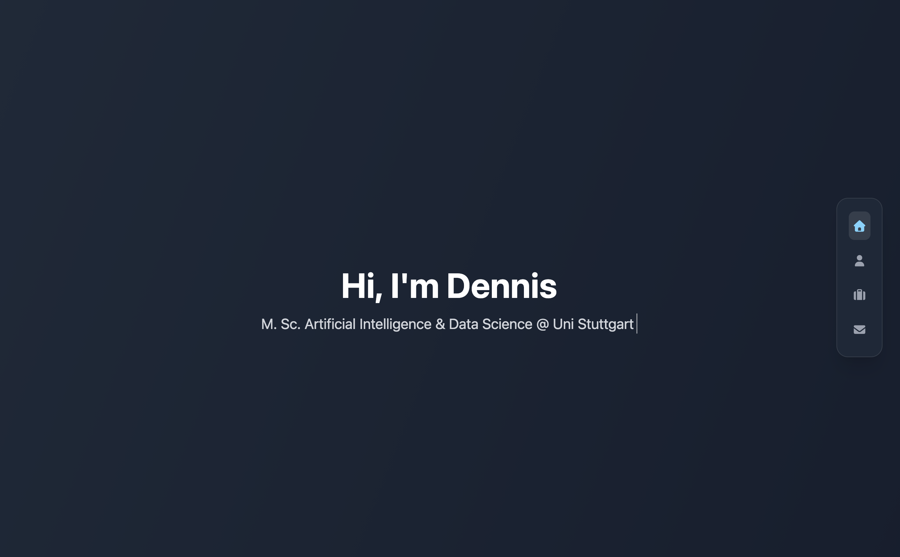

<h1 align="center">Portfolio Website</h1>

<p align="center">
  
  
  
  
  
</p>

<p align="center">
  My personal portfolio website — featuring smooth scroll-snap navigation, a macOS dock-style navbar, and interactive project cards.
</p>

---

## Demo



**Live:** [dennisd-portfolio.vercel.app](https://dennisd-portfolio.vercel.app/)

---

## Features

- **Scroll-snap single-page layout** with smooth section-based navigation via anchor links (`#home`, `#about`, `#projects`, `#contact`)
- **macOS Dock-style navbar** — fixed vertical sidebar with magnifier effect and IntersectionObserver-based active section highlighting
- **Typewriter effect** on the Home section with looping text animation
- **Marquee tech-stack display** showcasing skills with animated scrolling rows
- **Framer Motion animations** for section transitions and interactive elements
- **Contact form** powered by EmailJS for direct email sending
- **3D tilt effect** on project cards via custom `useTilt` hook
- Modern dark UI styled with **Tailwind CSS v4**
- Responsive layout for desktop, tablet, and mobile

---

## Featured Projects

| Project | Description | Stack | Links |
|---|---|---|---|
| **Smart Document Agent** | Local RAG app — query PDFs via chat with source attribution | Python, LangChain, ChromaDB, Streamlit | [GitHub](https://github.com/Dennis-Diehl/smart-document-agent) · [Demo](https://smart-document-agent.streamlit.app/) |
| **AI Model Budget Router** | Smart LLM routing based on budget, task type & quality | Python, FastAPI, Streamlit | [GitHub](https://github.com/Dennis-Diehl/ai-model-api-budget-router) · [Demo](https://ai-api-budget-router.streamlit.app/) |
| **Online Marketplace** | Full-stack buy/sell platform with buyer & seller roles | Python, Flask, MySQL | [GitHub](https://github.com/Dennis-Diehl/online-marketplace) |

---

## Tech Stack

| Category | Technology |
|---|---|
| Framework | React 19 |
| Language | TypeScript 5.9 |
| Styling | Tailwind CSS v4 (via PostCSS) |
| Build Tool | Vite 7 |
| Animations | Framer Motion |
| Icons | Font Awesome (React) |
| Contact Form | EmailJS (`@emailjs/browser`) |
| Linting | ESLint 9 with TypeScript & React plugins |
| Deployment | Vercel |

---

## Project Structure

```
src/
├── main.tsx                    # App entry point
├── App.tsx                     # Root component — renders all scroll-snap sections
├── components/
│   ├── Home/
│   │   ├── Home.tsx            # Hero section
│   │   └── TypewriterLoop.tsx  # Looping typewriter animation
│   ├── About/
│   │   ├── About.tsx           # About section
│   │   ├── TechCard.tsx        # Individual tech stack card
│   │   └── MarqueeRow.tsx      # Animated marquee row
│   ├── Projects/
│   │   ├── Projects.tsx        # Projects section
│   │   ├── ProjectCard.tsx     # Project card with 3D tilt effect
│   │   └── ProjectDetail.tsx   # Expanded project detail view
│   ├── Navbar.tsx              # Fixed vertical sidebar (dock-style)
│   └── Contact.tsx             # Contact form with EmailJS
├── data/
│   ├── projects.ts             # Project data & descriptions
│   ├── techStack.ts            # Tech stack items for About section
│   ├── navLinks.ts             # Navigation link definitions
│   └── socialLinks.ts          # Social media links
├── hooks/
│   ├── useActiveSection.ts     # IntersectionObserver for active nav item
│   └── useTilt.ts              # 3D tilt effect for cards
├── assets/
│   └── images/                 # Static images and project screenshots
└── styles/
    └── index.css               # Global styles, Tailwind import, scroll-snap config
```

---

## Getting Started

### Prerequisites

- Node.js (latest LTS recommended)
- npm or a compatible package manager

### Installation

```bash
# 1. Clone the repository
git clone https://github.com/Dennis-Diehl/PortfolioWebsite.git
cd PortfolioWebsite

# 2. Install dependencies
npm install

# 3. Start the development server
npm run dev
```

The app will be available at `http://localhost:5173`.

### Available Scripts

| Script | Description |
|---|---|
| `npm run dev` | Start the Vite development server |
| `npm run build` | Create an optimized production build |
| `npm run preview` | Preview the production build locally |
| `npm run lint` | Run ESLint across the codebase |

---

## Deployment

The site is deployed on **Vercel**. Every push to `main` triggers an automatic production deployment.

---

## License

This project is licensed under the [MIT License](LICENSE).
