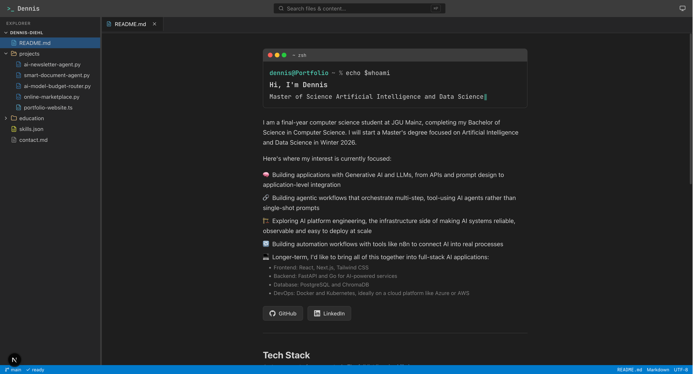

<h1 align="center">Portfolio IDE Edition</h1>

<p align="center">
  
  
  
  
  
</p>

**My personal portfolio, reimagined as a VS Code-style editor.**

Projects and education live as files in a navigable explorer and open as draggable tabs. The site
ships with full-text search, light and dark theming, and a resizable sidebar, all built on top of a
single content registry that keeps the file tree, the routing, and the search index in sync
automatically.

---

## Features

- A VS Code-style file explorer with collapsible folders, where opened files become draggable tabs
- Interactive terminal-style hero that types out a live `echo $whoami` sequence with a looping subtitle
- Full-text search (`Ctrl`/`Cmd`+`P`) across file names, keyword metadata, and page content, with highlighted snippets
- Draggable tabs for reordering open files, fully keyboard-operable with chained `Delete`/`Backspace` closing
- Resizable sidebar on desktop, a modal overlay on smaller screens, hidden on mobile
- Light, dark, and system theme switching
- A recruiter-friendly default state, the README opens on first load with the two latest projects, a tech-stack summary, and education already highlighted
- An empty-tabs easter egg that renders a live "Project Structure" tree of the site's own virtual file system
- Accessible IDE patterns throughout, including ARIA tree and tablist roles, keyboard navigation, a skip link, and real deep-linkable routes for every file
- Fully statically generated, no server and no runtime secrets

---

## Technical Highlights

- **Single content registry**: `src/content/registry.ts` builds a virtual file system from the raw project and education data. Adding a project to `src/content/projects.ts` automatically creates its route, its explorer entry, and its searchable document, with nothing to keep in sync by hand.
- **Tabs decoupled from routing, but always consistent**: open tabs live in their own state, derived from and synchronized with the current URL. Reloading the page always resets to just the README, so a shared link never carries someone else's leftover browsing state.
- **Build-time search index**: `scripts/build-search-index.ts` runs before every build and flattens the registry into `public/search-index.json`, so the client-side search never has to parse or fetch the underlying content data directly.

---

## Preview



**Live:** [dennisd-portfolio.vercel.app](https://dennisd-portfolio.vercel.app/)

---

## Tech Stack

| Category | Technology |
|---|---|
| Framework | Next.js 16 (App Router) |
| UI | React 19 |
| Language | TypeScript |
| Styling | Tailwind CSS v4 (design tokens via `@theme`) |
| Theming | next-themes |
| Drag & Drop | @dnd-kit |
| Icons | lucide-react, plus custom brand SVGs |
| Testing | Vitest, Playwright, axe-core |
| Package Manager | pnpm |
| Deployment | Vercel |

---

## Project Structure

```
src/
├── app/
│   ├── layout.tsx              # Fonts, metadata, ThemeProvider
│   └── (ide)/
│       ├── layout.tsx          # Persistent IDE shell: title bar, sidebar, tabs, status bar
│       ├── page.tsx            # "/" → README
│       ├── [...slug]/page.tsx  # Every other file, statically generated
│       └── not-found.tsx       # In-shell "file not found"
├── content/                    # Source of truth: projects, education, tech stack, registry
├── components/
│   ├── ide/                    # Shell, explorer, tabs, search palette
│   │   ├── HeroTerminal.tsx    # Live-typed terminal on the README
│   │   ├── TechSummary.tsx     # Compact skillicons.dev-style tech row
│   │   ├── EditorPane.tsx      # Swaps in the empty-tabs easter egg
│   │   ├── EmptyEditorState.tsx
│   │   └── views/              # Per-file-kind editor views: Project, Education, Skills, and more
│   └── theme/                  # ThemeProvider and toggle
├── lib/                        # Tab reducer, search engine, media-query hook
e2e/
└── portfolio.spec.ts           # Playwright end-to-end and accessibility tests
scripts/
└── build-search-index.ts       # Generates public/search-index.json on prebuild
```

---

## Quick Start

Requires Node.js 22+ and [pnpm](https://pnpm.io/) 11+.

```bash
git clone https://github.com/Dennis-Diehl/PortfolioWebsite.git
cd PortfolioWebsite
pnpm install
pnpm dev
```

The app runs at `http://localhost:3000`.

### Available Scripts

| Script | Description |
|---|---|
| `pnpm dev` | Start the Next.js dev server |
| `pnpm build` | Build the search index, then the production site |
| `pnpm start` | Serve the production build |
| `pnpm lint` | Run ESLint |
| `pnpm typecheck` | Type-check with `tsc --noEmit` |
| `pnpm test` | Run Vitest unit tests |
| `pnpm exec playwright test` | Run Playwright end-to-end and accessibility tests |

---

## Adding Content

- A project: add an entry to `src/content/projects.ts` and drop its screenshot in `public/images/projects/`.
- An education entry: add an entry to `src/content/education.ts`.
- A tech-stack item: add an entry to `src/content/techStack.ts`.

Everything else, the route, the explorer node, the search index, and the metadata, updates automatically.

---

## Testing

- **Unit** (Vitest): tab reducer, search ranking and snippets, registry tree builder.
- **End-to-end** (Playwright, desktop and mobile): first-visit README, deep links, search, tab closing, mobile overlay.
- **Accessibility** (axe-core): runs inside the E2E suite. The build fails on WCAG 2 A/AA violations.

CI (`.github/workflows/ci.yml`) runs lint, typecheck, unit, build, and e2e on every push and pull request.

---

## License

This project is licensed under the [MIT License](LICENSE).
